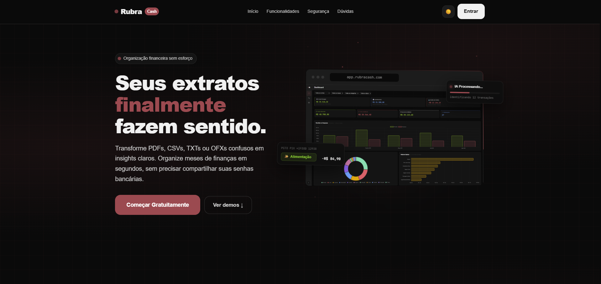

<div align="center">
  <br />
  
  <h1>Rubra Cash</h1>
  <p><strong>A modern personal finance manager with AI-powered bank statement import.</strong></p>
  <a href="https://rubra-cash.vercel.app">Live App →</a>
  <br /><br />
</div>

> **Rubra Cash** is a full-stack personal finance application designed to eliminate the friction of manual data entry. Upload your bank statements, and our AI pipeline automatically extracts, categorizes, and organizes your transactions, using your custom categories and notes as context for AI classification.



## Features

- **AI-Powered Statement Import** — Upload your statements (PDF, OFX, or CSV) and let `gemini-2.5-flash` extract and structure the data automatically.
- **Transaction Management** — Create, edit, and delete transactions. Transfers between accounts are automatically mirrored.
- **Custom Categories** — Build your own category and subcategory trees to provide context for AI classification.
- **Account Hierarchy** — Organize accounts with parent/child relationships and consolidate your balances.
- **Prompt Notes** — Write short financial notes to give the AI extra context for smarter classification.
- **Dashboard & Analytics** — Get a clear overview of your current balances, recent transactions, and spending breakdowns.
- **Theming & PWA** — Built-in light/dark mode and installable as a standalone app on mobile devices.

## Tech Stack

| Layer | Technology |
|---|---|
| **Framework** | Next.js (App Router), TypeScript, Tailwind CSS |
| **Database** | PostgreSQL (Supabase), Prisma ORM |
| **Authentication** | Supabase Auth |
| **AI Integration**| OpenRouter (Gemini / GPT) |
| **Testing** | Jest, Testing Library |
| **Deployment** | Vercel |

## Testing

The project is backed by **94 tests across 10 test suites**, covering API endpoints, services, integration flows, and the frontend data context layer.

Instead of heavily mocking the database, the integration and API tests run against a **real PostgreSQL database** and use **real Supabase authentication**. Tests create temporary users, obtain valid JWTs, and make authenticated HTTP requests directly to the Next.js route handlers, ensuring the entire stack is exercised from the API boundary down to the database.

## Security

- **API Key Encryption:** Users can provide their own OpenRouter API key, which is encrypted at rest using AES-256-GCM. The key is only decrypted on the server during AI processing and is never exposed to the client.
- **Authentication & Isolation:** All data access is protected by server-side JWT verification and isolated per user at both the application and database levels.

## Quick Start

```bash
# Clone the repository
git clone https://github.com/Bernardons04/rubra-cash-next.git
cd rubra-cash-next

# Install dependencies
npm install

# Configure environment variables
cp .env.example .env
```

Ensure you configure the variables in your `.env` file (Supabase credentials, Database URLs, and `ENCRYPTION_KEY`).

```bash
# Generate the Prisma client
npx prisma generate

# Start the development server
npm run dev
```

The application will be available at `http://localhost:3000`.
